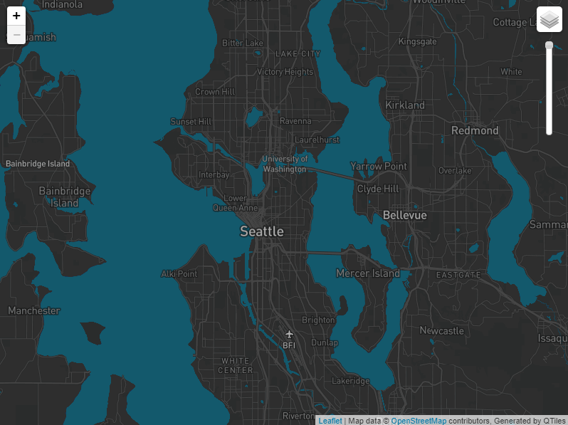

# Seattle Map Tiles

## Description
This map was created from a custom tile server built in Mapbox Studio. A tile layer was then generated of the Seattle area using the QMetaTiles plugin in QGIS with a zoom level ranging from 11-13.

The interactive map can be accessed [here](https://gordydelap.github.io/seattle-map-tiles/). Interact with the map by adusting the basemap slider, or by toggling the tile layer on and off.
